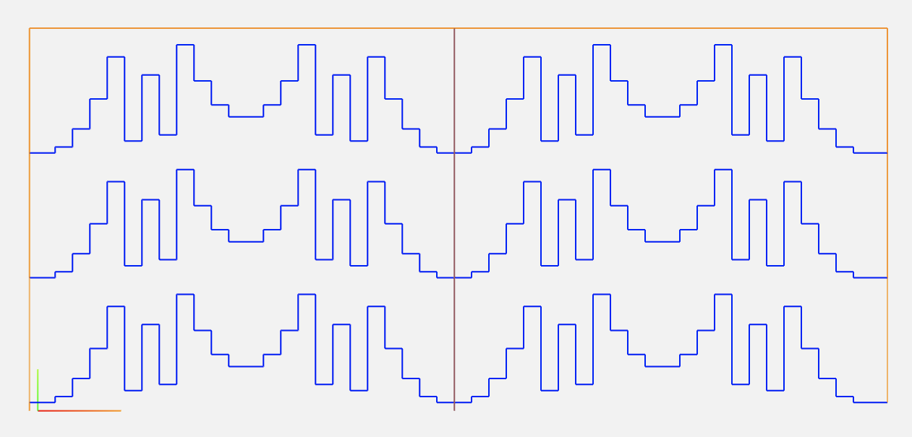

# Simple G-code generator Python script

> Generates G-Code for CNC foam cutter. Allows to make producton files based on CSV templates. CSV templates are generated with additional py scripts.

 GCODE, QRD, DIY, PrimeRoot, Quadratic, Residue

## Table of Contents

- [Installation](#installation)
- [Features](#features)
- [Usage](#usage)
- [Support](#support)
- [License](#license)

## Installation

- GIT clone repository to your computer
- Make py files executable
- Run program with command line parameters
- Samples, csv matrices and ready to go production files are provided

### Clone

- Clone this repo to your local machine using `https://github.com/barteqm/QRD-G-Code-Generator/`

---

## Features
- generates nice gcode that can be used in styro foam diffusers production on CNC foam 2d cutter. Those are the effects:

## Usage
- "pr_gen.py" - generates 2D prime root matrices for gcode generator
- "qrd_gen.py" - generates 2D quadratic residue matrices for gcode generator
- "header.gcode" - part of code that is put in header - enables adding some config parameters
- "footer.gcode" - ending part of gcode - no need to change
- you can also use your own matrices with custom well/column lengts and numbers that gcode_gen.py will acceppt
- in CSV folder you can find sample matrices in csv format to use with generator
- generated files can be previewed with for ex. here: 'https://ncwiever.com/'

Example preview of gcode file:
3x2_QRD23_150mm_halfcut.nc

Usage:
'./gcode_gen.py <matrix_file.csv> <cutting_velocity> <bottom offset> <material_height> <material_width> <divider> <output_file.nc>'

Where:
- <matrix_file.csv>  - file with shape of diffuser in universal units. generated with for ex. qrd_gen.py or created manually
- <cutting_velocity>  - velocity used when cutting material - has to be set experimentally - velocity depends on humidity of foam, temp of cutting wire etc.
- <bottom offset> - depth of bottom layer of diffuser that holds everything in place
- <material_height> - height of a single styrofoam prefab
- <material_width>  - width of a single styrofoam prefab
- <divider> - how many prefabs are generated (how many styro foam pieces lay on each other)
- <output_file.nc> - gcode output file

---
## Support
There's no support, its just single piece of code you can use in your DIY projects. If you have any further questions yo can always reach me thru my homepage: 'http://bartekmagdon.com'
---

## License

- **[MIT license](http://opensource.org/licenses/mit-license.php)**
- Copyright 2017 © Bartek Magdon